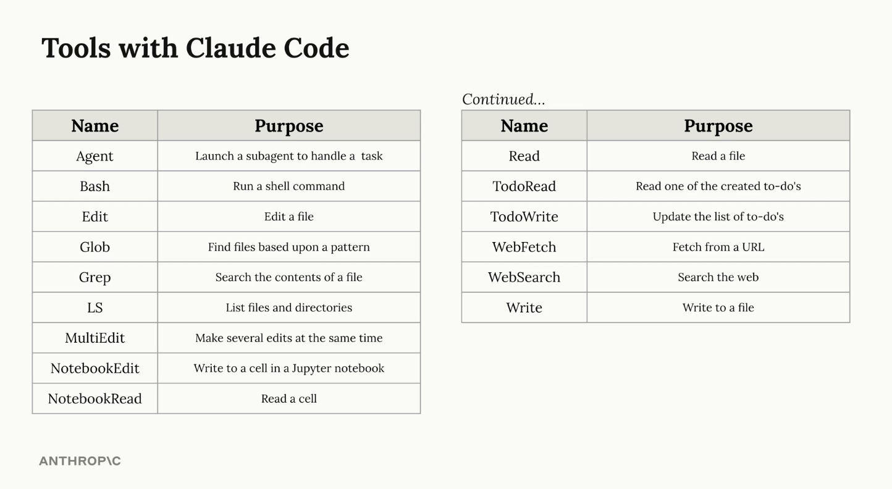
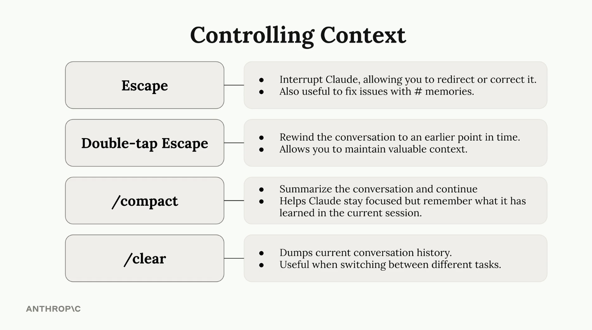

# Coding Agent

A **coding agent** is an AI system that can understand programming tasks, make a plan to solve them, and use tools (like reading files, writing code, or running commands) to complete the task automatically.

Unlike simple code assistants that only suggest code, a coding agent can **analyze problems, interact with the codebase, and take actions to fix or improve software**.

## In Simple Words

A coding agent is like a **smart programmer assistant** that can:

* Understand a problem
* Decide what steps are needed
* Use tools to read or change code
* Execute commands
* Provide a solution

## Key Idea

**AI brain + tools = coding agent**



# Claude Code Setup Guide

Full setup directions can be found here:
https://code.claude.com/docs/en/quickstart

## Quick Installation

Below are the commands to install **Claude Code** depending on your operating system.

### MacOS (Homebrew)

```bash
brew install --cask claude-code
```

### MacOS, Linux, WSL

```bash
curl -fsSL https://claude.ai/install.sh | bash
```

### Windows (CMD)

```cmd
curl -fsSL https://claude.ai/install.cmd -o install.cmd && install.cmd && del install.cmd
```

## After installation, 
run **claude** at your terminal. The first time you run this command you will be prompted to authenticate

### Ask your first questions 

```bash 
what does this project do?

what technologies does this project use?

where is the main entry point?

explain the folder structure
```

Ask Claude about its own capabilities: 

```bash 
what can Claude Code do?

how do I create custom skills in Claude Code?

can Claude Code work with Docker?
```

Make your first code change: 

```bash 
add a hello world function to the main file
```

Use Git with Claude Code 

```bash 
what files have I changed?

commit my changes with a descriptive message

create a new branch called feature/quickstart

show me the last 5 commits

help me resolve merge conflicts
```

Fix a bug or add a feature

```bash
add input validation to the user registration form

there's a bug where users can submit empty forms - fix it
```

Test out other common workflows

```bash
refactor the authentication module to use async/await instead of callbacks
```

Write tests

```bash
write unit tests for the calculator functions
```

Update documentation

```bash 
update the README with installation instructions
```

Code review

```bash
review my changes and suggest improvements
```

# Claude Code CLI Reference

Complete reference for the **Claude Code command-line interface**, including commands and flags.

---

# CLI Commands

Start sessions, pipe content, resume conversations, and manage authentication with these commands.

| Command | Description | Example |
|------|------|------|
| `claude` | Start interactive session | `claude` |
| `claude "query"` | Start interactive session with initial prompt | `claude "explain this project"` |
| `claude -p "query"` | Run query and exit (print mode) | `claude -p "explain this function"` |
| `cat file \| claude -p "query"` | Process piped content | `cat logs.txt \| claude -p "explain"` |
| `claude -c` | Continue most recent conversation | `claude -c` |
| `claude -c -p "query"` | Continue conversation via SDK | `claude -c -p "Check for type errors"` |
| `claude -r "<session>" "query"` | Resume session by ID or name | `claude -r "auth-refactor" "Finish this PR"` |
| `claude update` | Update Claude Code to latest version | `claude update` |
| `claude auth login` | Log in to Anthropic account | `claude auth login --email user@example.com` |
| `claude auth logout` | Log out of account | `claude auth logout` |
| `claude auth status` | Show authentication status | `claude auth status` |
| `claude agents` | List configured subagents | `claude agents` |
| `claude mcp` | Configure MCP servers | `claude mcp` |
| `claude remote-control` | Start remote control session | `claude remote-control` |

---

# Useful CLI Flags

Customize Claude's behavior with flags.

| Flag | Description | Example |
|------|------|------|
| `--add-dir` | Add extra directories Claude can access | `claude --add-dir ../apps ../lib` |
| `--agent` | Specify which agent to use | `claude --agent my-custom-agent` |
| `--agents` | Define custom subagents using JSON | `claude --agents '{...}'` |
| `--append-system-prompt` | Add instructions to the default prompt | `claude --append-system-prompt "Always use TypeScript"` |
| `--continue` / `-c` | Continue last conversation | `claude --continue` |
| `--debug` | Enable debug logging | `claude --debug "api,mcp"` |
| `--model` | Specify model (sonnet, opus) | `claude --model sonnet` |
| `--output-format` | Specify output format | `claude -p "query" --output-format json` |
| `--resume` / `-r` | Resume specific session | `claude --resume auth-refactor` |
| `--system-prompt` | Replace default system prompt | `claude --system-prompt "You are a Python expert"` |
| `--tools` | Restrict tools Claude can use | `claude --tools "Bash,Edit,Read"` |
| `--verbose` | Enable verbose logging | `claude --verbose` |
| `--version` / `-v` | Show version number | `claude -v` |

---

# System Prompt Flags

These flags control how you customize Claude’s system prompt.

| Flag | Behavior | Modes | Use Case |
|------|------|------|------|
| `--system-prompt` | Replace entire default prompt | Interactive + Print | Full control of Claude behavior |
| `--system-prompt-file` | Replace prompt with file contents | Print only | Use version-controlled prompts |
| `--append-system-prompt` | Append instructions to default prompt | Interactive + Print | Add rules without losing defaults |
| `--append-system-prompt-file` | Append file contents to default prompt | Print only | Add version-controlled rules |

---

# Example: Custom Agents

```bash
claude --agents '{
  "code-reviewer": {
    "description": "Expert code reviewer",
    "prompt": "You are a senior code reviewer focusing on code quality and security",
    "tools": ["Read", "Grep", "Glob", "Bash"],
    "model": "sonnet"
  },
  "debugger": {
    "description": "Debugging specialist",
    "prompt": "Analyze errors and identify root causes"
  }
}'
```


